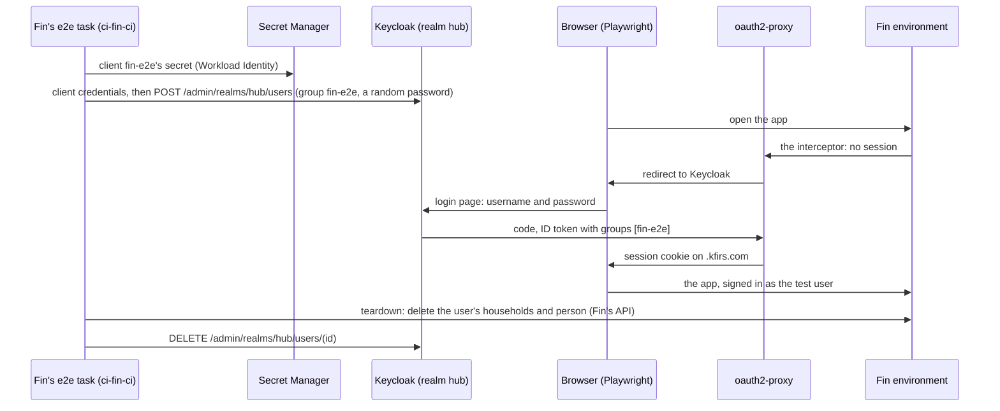

# Test users

**Decision**: Fin's end-to-end tests sign in as people of their own. Each test creates a user in realm `hub`, in group
`fin-e2e`, signs it in through the hub's real sign-in with a password, and deletes it when it ends. Keycloak shows its
login page, a password form beside Google, to everyone. Fin's CI holds client `fin-e2e`, which may create, sign in and
delete `fin-e2e`'s members, and nobody else. The hub's tools admit only group `admins`; test users reach only Fin.

## Why

- Fin's end-to-end suite moves to its deployed environments: each pull request's, the merge queue's and production
  ([Fin's slice 12](../../fin/designs/architecture.md#rollout)). They sit
  behind the hub's sign-in, which admits only users of realm `hub`.
- Realm `hub` held only the people Terraform declares, and they sign in only with Google, which a test can't do.
- Every signed-in hub user was an Argo CD admin, a Grafana admin and an editor in the Tekton Dashboard. A test user,
  which any of Fin's branches can create, must be none of these.

## Design

| Part | Design | Where |
| --- | --- | --- |
| Login page | Realm `hub`'s browser flow `browser-form`: an existing session (`auth-cookie`), else Keycloak's login page, with the username and password form (`auth-username-password-form`) and a button for identity provider `google`. People keep signing in with Google; only test users have passwords. Realm `master` keeps `browser-google` | infra, `terraform/keycloak` |
| Group `admins` | The people Terraform declares with `admin = true`. The hub's tools admit only them | infra, `terraform/keycloak` |
| Group `fin-e2e` | Test users, which runs create and delete, never Terraform. Each is `e2e-<uuid>@<environment>.fin.example` (username and email, verified; the environment whose data it holds), with a first and a last name, so Keycloak asks nothing more at sign-in, and a random password | infra (the group), fin (its members) |
| Groups claim | Client `hub`'s tokens carry `groups`, the user's groups by name (no path): oauth2-proxy checks it on the hub's tools, and fin-api reads it | infra, `terraform/keycloak` |
| Client `fin-e2e` | Confidential, service account only, no flows. Realm `hub`'s admin permissions (Keycloak's fine-grained admin permissions, v2) give it `view`, `view-members`, `manage-members` and `manage-membership` on group `fin-e2e`, through a client policy: it lists, creates, sets passwords for and deletes `fin-e2e`'s members, and gets 403 for anyone else | infra, `terraform/keycloak` |
| Its secret | Terraform generates it and writes it write-only to Keycloak and to `ci-fin-e2e-keycloak-secret`, a pipeline secret: `ci-fin/ci-fin-ci` reads it at run time through Workload Identity; no Kubernetes Secret holds it | infra, `terraform/keycloak` and `terraform/gcp` |
| Admin API | The operator's NetworkPolicy admits `ci-fin` too, so Fin's CI reaches the admin API at `http://keycloak-service.keycloak.svc.cluster.local:8080`, as `ci-infra` does. Keycloak's public hosts don't route `/admin` | delivery, `platform/keycloak` |
| Admins only | Middleware `admins` in each tool's namespace, a ForwardAuth to oauth2-proxy's `/oauth2/auth?allowed_groups=admins`, on the routes of Argo CD, the Tekton Dashboard, Grafana, the Traefik dashboard, NUI, the docs site, Keycloak's console and realm `master`'s sign-in. The interceptor still signs people in first; a signed-in user outside `admins` then gets 403 | delivery (its `docs/delivery/designs/admins-only.md`) |
| Client `fin-local` | Public, standard flow with PKCE (`S256`), redirect URI `http://localhost:5173/oauth2/callback` only, and the `groups` mapper. Fin's local development: its dev server signs a developer in through it, a person with Google or a test user with a password, and the local fin-api accepts its ID tokens, so Fin needs no dev user | infra, `terraform/keycloak`; fin |
| Fin | Admits every signed-in hub user, test users included, as before | unchanged |

## Decisions

| Decision | Why | Rejected |
| --- | --- | --- |
| Test users in realm `hub`, which each run creates and deletes | The hub's sign-in is the only way into Fin's environments, and tests that run at once need people of their own, a few hundred a day | A fixed pool of declared test users: runs would share them, and their passwords would live in Secret Manager. A realm of their own: not the hub's sign-in, and fin-api trusts only realm `hub` |
| Keycloak's login page for everyone, with a password form and a Google button | A test can't sign in with Google. The owner's choice: one more click, on Google, when the SSO session lapses (7 idle days) | The form only when a test asks for it, through an extra scope and a conditional flow: Google stays automatic, but the tests rewrite Keycloak's redirect |
| Realm `master` keeps going straight to Google | Only admins sign in there, and no test user exists in it | One flow for both realms |
| No brute-force detection, for now | Keycloak counts a wrong password against the person the username names, even one with no password, and a locked-out person can't sign in with Google either: anyone who knows a person's email, the owner's included, could keep them out of the hub for 15 minutes at a time. Detection would guard nothing: only test users have passwords, random ones that last one run. The owner's call; a per-IP limit on sign-in attempts comes later ([Open questions](#open-questions)) | Detection on, which Keycloak can't exempt people from |
| Fine-grained admin permissions on group `fin-e2e` only | `manage-users` would let a run from any branch take over any hub user, the owner's included, and with it Argo CD. Since 26.8, Keycloak lets whoever has `view`, `manage-members` and `manage-membership` on a group create users in it ([keycloak#53013](https://github.com/keycloak/keycloak/issues/53013)) | `manage-users` of realm `hub` |
| The secret read at run time through Workload Identity | Octomaton mounts Secrets only for pipelines whose every trigger reads the default branch's definitions; a pull request's, a merge group's and a push's can't list one | An ExternalSecret in `ci-fin` |
| `ci-fin/ci-fin-ci` reads it, from any branch | Pull requests' runs need test users. With it, a branch can create, sign in as and delete test users, which reach only Fin | An identity for `main` only: pull requests' runs couldn't sign in |
| The hub's tools admit only `admins` | Test users reach only Fin. A tool's own roles (Argo CD's `policy.default`, Grafana's `auto_assign_org_role`) stay as they are, behind the route | Argo CD's RBAC alone: Grafana, the Tekton Dashboard and NUI would stay open to test users |
| A public client for Fin's local development, with PKCE | Fin's dev user goes with the end-to-end suite's move: local development signs in through realm `hub` as people do, through the same login page. A public client keeps no secret on developers' machines, and PKCE ties each code to the browser that asked for it | The hub's own sign-in for the local app, at a `kfirs.com` host: TLS on every developer's machine, and oauth2-proxy's redirects widened to it. No local sign-in at all: changes a person sees could be tried only in a pull request's environment |
| No Keycloak backups first | The owner's choice: test users last one run, and the CI client can touch no one else. Losing the database still costs only sessions and Google links | CloudNativePG with backups first ([Keycloak, later](../../hub/designs/keycloak.md#later)) |

## Security and failure modes

- **Any of Fin's branches can create users who sign in to Fin's environments, production included.** They reach
  nothing else: the hub's tools answer them 403, and the client can't touch anyone outside `fin-e2e`.
- **A run that dies before its teardown leaves its users.** Each run tears down its own environment's `fin-e2e` members
  created over an hour before, with what they kept in Fin, and deletes other pull requests' created over a day before;
  only production's runs touch production's.
- **Reports show what the tests typed.** Playwright's traces, on the docs site's reports, hold the test users'
  passwords. The users are deleted before the report goes up, but a dead run's users live until the next sweep; the
  docs site now admits only `admins`.
- **The groups claim comes first.** The `admins` middleware reads `groups` from the session: deployed before Keycloak
  sends the claim, it would lock everyone, the owner included, out of the hub's tools. A session that predates the claim
  gets it at its next refresh, within 5 minutes.
- **Client `fin-local` is public.** Anyone may start its sign-in, but Keycloak still admits only realm `hub`'s users, its
  codes go only to `localhost:5173` on the machine whose browser signed in, and no deployed fin-api accepts its tokens,
  which name `fin-local`, not `hub`.
- **Only test users have passwords.** People sign in with Google, and the password form fails for them however often
  anyone tries it: with no brute-force detection, wrong passwords lock no one out. A test user's password is 32 random
  characters and lasts one run, which no guessing reaches.

## Rollout

| Step | Where | What |
| --- | --- | --- |
| 1 | `docs` | The [reference](../../hub/reference.md#authentication) names everything the next steps make |
| 2 | `infra` | This design; `terraform-plan` may view realm `hub`'s clients, for step 3's data source. A pull request of its own: its plan needs nothing new, and `apply` grants it as `terraform-apply` |
| 3 | `infra` | Realm `hub`'s login page; groups `admins` and `fin-e2e`; the groups claim; admin permissions; client `fin-e2e` and its secret. In `terraform/gcp`: the secret's container and `ci-fin-ci`'s access. The merge applies it |
| 4 | Check | Sign in again: Keycloak's page shows the password form and Google; the ID token carries `groups: ["admins"]` |
| 5 | `delivery` | Middleware `admins` on the hub's tools; Keycloak admits `ci-fin`. After step 4 |
| 6 | `fin` | The suite creates its test users ([Fin's slice 12](../../fin/designs/architecture.md#rollout)) |

## Open questions

- **Where to limit sign-in attempts per IP address.** Traefik's `RateLimit` middleware on Keycloak's routes, or
  Keycloak itself. The owner wants one, in the plan. Until then, a wrong password costs Keycloak one password hash and
  locks no one out.
